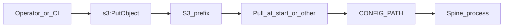

# Reference: ECS Fargate, GHCR, and external operator config (S3)

This page is **one** documented way to run Spine on AWS. It uses **placeholders only** (`s3://your-bucket/your-prefix/`, generic IAM actions). It is not the only supported deployment: operators may use bind mounts, EFS, init containers, or a **child** wrapper image.

---

## Who does what

| Layer | What it is | Where it lives |
|-------|------------|----------------|
| **Spine (OSS)** | Generic image, `CONFIG_PATH` contract, **boto3** pull at start when `SPINE_CONFIG_S3_URI` is set, optional **CLI** `s3_config_push` for promotion | This repository and `ghcr.io` (or your fork’s registry) |
| **Operator** | `defaults.yml`, `sources/*.yml`, `queries/*.sql`, secrets, how you promote config | Your machine, CI, and AWS resources in **your** account |
| **Orchestration** | VPC, IAM, ECS task definitions, scheduling, observability | Your AWS account and tooling of your choice |

Spine stays generic: the public image does not bake in account-specific ARNs or bucket names.

### Config flow

S3 is not a filesystem mount. **Promotion** (upload) and **runtime** (files on disk inside the task) are separate unless you connect them.



1. **Promotion:** upload a `CONFIG_PATH`-shaped tree to `s3://your-bucket/your-prefix/` (for example with `python -m src.utils.s3_config_push`, `aws s3 sync`, or CI). Requires `s3:PutObject` (and listing as your tooling needs).
2. **Runtime:** files must exist on disk at `CONFIG_PATH` before `python -m src.main`. The stock image can **pull from S3 using boto3** when `SPINE_CONFIG_S3_URI` is set (see below)—**no AWS CLI, no sidecar, no child image** for that path. Alternatives remain: `aws s3 sync` in `command`, EFS, init containers, etc.

---

## ECS: simplest path (env only, default entrypoint)

The public image **`ENTRYPOINT`** is `/startup.sh` (Redis, then `python -m src.main`). You do **not** need to override `command` or `entryPoint` if you use the built-in pull:

1. Set **`SPINE_CONFIG_S3_URI`** to your operator prefix, for example `s3://<bucket-from-your-infra>/config/` (objects under that prefix should mirror `defaults.yml`, `sources/…`, `queries/…`).
2. Optionally set **`CONFIG_PATH`** to an **absolute** directory inside the container (recommended for clarity). If unset, pull targets **`/config`**, which matches Spine’s default resolution for `CONFIG_PATH=.`.

`startup.sh` runs `python -m src.utils.s3_config_pull` (boto3) before the app. The task **IAM role** must allow **`s3:GetObject`** on `prefix/*` and **`s3:ListBucket`** on the bucket (often prefix-scoped in the bucket policy).

**Merge vs delete:** pull **downloads and overwrites** keys that exist in S3; it does **not** delete extra files already on disk under the target path (unlike `aws s3 sync --delete`). The image may ship template files under `/config`; if that is a problem, set `CONFIG_PATH` to a dedicated empty path (for example `/config-runtime`) and pull there instead.

---

## ECS: how S3 config reaches the container (all options)

**Important:** a task definition does **not** mount S3. The process only reads **local files**.

| Approach | What you set | Notes |
|----------|----------------|------|
| **Built-in boto3 pull** | `SPINE_CONFIG_S3_URI` (+ optional `CONFIG_PATH`) | No AWS CLI; keep default `ENTRYPOINT`. |
| **`aws s3 sync` in `command`** | Override `command` / `entryPoint` | Requires AWS CLI in the image or a wrapper image. |
| **EFS** | Volume mount + `CONFIG_PATH` on the mount | Different operational model. |

---

## Do I need to update the task definition when I change config on S3?

**Usually no** for the **built-in pull** or `sync` on every start: each new task run downloads the **current** objects for that prefix (into ephemeral disk or over the previous layer). Changing objects in S3 is enough for the **next** run.

**You register a new revision** when you change **how** the task runs (image, CPU/memory, **environment variable keys/values that encode infra** such as a different bucket URI if you store it in the task def, secrets ARNs, `command`/`entryPoint`, IAM, etc.).

---

## Promote local `config/` to S3 (Spine CLI)

One-off or CI step from a checkout that has your real operator files under `config/`:

```bash
python -m src.utils.s3_config_push s3://your-bucket/your-prefix/
```

- Resolves the local tree like runtime `CONFIG_PATH`: uses the `CONFIG_PATH` environment variable if set (absolute path, or relative segment under `config/`), otherwise `config/` at the repo root.
- Uploads only **operator** paths: `defaults.yml`, `sources/**/*.yml`, `queries/**/*.sql`.
- Skips templates and noise: `config/examples/`, `*.example.yml`, `README.md`, `.gitkeep`.

Requires AWS credentials (profile or env) with **`s3:PutObject`** on `your-prefix/*` and **`s3:ListBucket`** on the bucket if your tooling needs it.

---

## Local operator validation with published image

From a fresh operator repository (config + `.env`, no Spine source checkout), run:

```bash
docker run --rm \
  -v "$(pwd)/config:/config:ro" \
  --env-file .env \
  ghcr.io/victorlou/spine:vX.Y.Z \
  --select your_source
```

This uses the default config path contract (`/config`). If you mount elsewhere, set `CONFIG_PATH` accordingly (for example `-e CONFIG_PATH=/my-config`).

Credential strategies:

- **AWS profile (static keys):** set `AWS_PROFILE` in `.env` and mount `-v "$HOME/.aws:/root/.aws:ro"`.
- **AWS profile (SSO):** mount `-v "$HOME/.aws:/root/.aws"` (writable) so SSO cache refresh can write under `/root/.aws/sso/cache`.
- **Direct env credentials:** set `AWS_ACCESS_KEY_ID`, `AWS_SECRET_ACCESS_KEY`, optional `AWS_SESSION_TOKEN`, and `AWS_REGION`.

For SSO profiles, login on host first:

```bash
aws sso login --profile your_profile
```

If you hit `The config profile (...) could not be found`, check profile name, mount presence, SSO freshness, and run:

```bash
aws sts get-caller-identity --profile your_profile
```

on the host to verify credentials before container startup.

For Windows operators using **Git Bash**, prefix `docker run` with:

```bash
MSYS_NO_PATHCONV=1 MSYS2_ARG_CONV_EXCL='*'
```

or run the command from PowerShell. Git Bash path conversion can rewrite `/root/.aws` and `/config`, causing false profile-not-found errors even when host credentials are valid.

---

## Container image: GitHub Container Registry (GHCR)

- **Public package:** ECS task definitions usually omit `repositoryCredentials`; any principal that can pull from `ghcr.io` can use the image reference.
- **Private package:** Configure `repositoryCredentials` (for example a Secrets Manager ARN for a GitHub PAT or deploy key) on the container definition, and grant the **task execution role** permission to read that secret.
- **Production pinning:** Prefer an **immutable digest** or a **semver tag** (`v1.2.3`), not a floating `latest`, so every revision is reproducible. The project’s CI publishes tags on `main` and on `v*` tags; pick the tag or digest your change control approves.

---

## S3 layout (contract)

Under a single S3 **prefix**, mirror the directory Spine expects at `CONFIG_PATH`:

- `defaults.yml`
- `sources/*.yml` (nested paths under `sources/` are fine)
- `queries/*.sql` (if used)

Example URI (neutral): `s3://example-org-spine-config/prod/`

---

## Environment variables (ECS task definition)

| Variable | Required | Purpose |
|----------|----------|---------|
| `SPINE_CONFIG_S3_URI` | Optional | When set, `docker/startup.sh` pulls this prefix into the sync target **before** `python -m src.main` (boto3). When unset, no S3 read for config at start. |
| `CONFIG_PATH` | Optional | **Absolute** path for config after pull. If unset while `SPINE_CONFIG_S3_URI` is set, pull uses **`/config`**. If both unset, Spine uses its normal default (`/config` via `CONFIG_PATH=.`). |
| `LOG_LEVEL` | Optional | Set to **`DEBUG`**, can be adjusted as defined in `src/utils/logger.py`.|
| Other app secrets | As needed | Use `secrets` from AWS Secrets Manager or SSM Parameter Store as supported by ECS. |

---

## AWS checklist

Use the AWS console, CloudFormation, CDK, Terraform, or any other approach—the items are the same:

1. **S3 bucket and prefix** for operator config (content may be uploaded by CI or `s3_config_push`).
2. **Task role** (runtime): `s3:GetObject` and `s3:ListBucket` (with `prefix` condition) on that prefix when using `SPINE_CONFIG_S3_URI`; plus any permissions your loaders and sources need (for example S3 writes, Databricks, etc.).
3. **Task execution role**: pull from GHCR; if the GHCR package is private, read the secret used in `repositoryCredentials`.
4. **Task definition**: image **digest or version tag**; environment `SPINE_CONFIG_S3_URI` (and optionally explicit `CONFIG_PATH`); keep default **`ENTRYPOINT`** `/startup.sh` unless you choose the AWS CLI `command` path; `secrets` for `.env`-style values; logging configuration.
5. **Networking**: outbound path to `ghcr.io` (often NAT); access to S3 via **VPC gateway endpoint** or NAT.
6. **Start order:** handled by `/startup.sh` when using `SPINE_CONFIG_S3_URI` (pull, then app). For other patterns, ensure files exist on disk before `python -m src.main`.

---


## Related documentation

- [Deployment overview](deployment.md) — Docker, CI, GHCR, runtime env vars.
- [Configuration overview](../configuration/overview.md) — `CONFIG_PATH` and directory layout.
